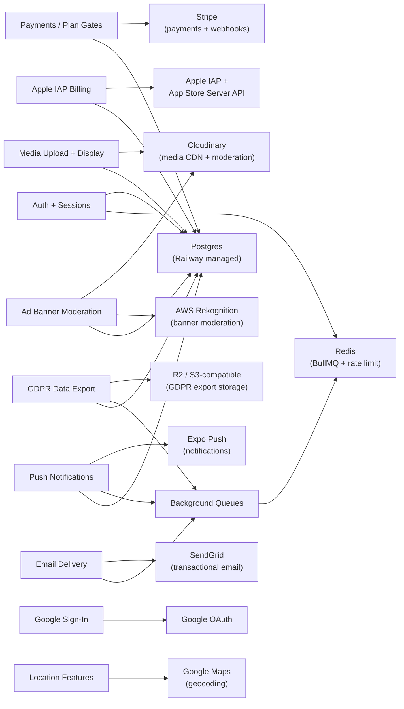
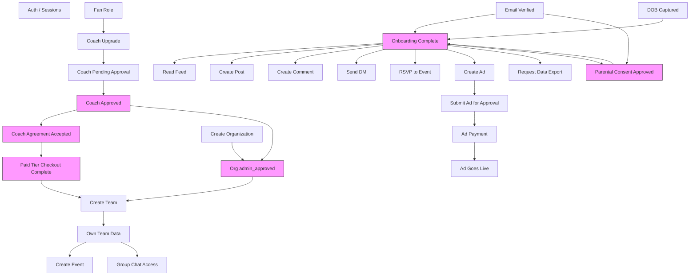

# Dependency Map

Two dependency views: (1) **service-level** — what external systems each
feature needs and what happens when they're down; (2) **feature-level** —
what internal middleware, libs, and upstream features each user-facing
capability requires.

Maintained alongside `RELEASE_SMOKE_TESTS.md` and
`COACH_APPROVAL_MATRIX.md`. If a service or feature is added, update
this file in the same PR so "what breaks if X goes down" stays current.

Last synced: against commit `39e70934`.

---

## 1. External services — failure-mode view

### Failure-mode table

| Service | Env vars | Hard-required at boot? | What breaks if down | Graceful degradation |
|---|---|---|---|---|
| **Postgres** | `DATABASE_URL` | Yes — server refuses to start | Everything | None — app is unusable |
| **Redis** | `REDIS_URL` | No — degrades | Data export worker silently no-ops; email/push/analytics queues fall back to immediate in-request processing; rate limiters fall back to in-memory | Export queue → 503 on POST. Email falls back to synchronous `EmailService.send`. Rate limits become per-process instead of cluster-wide |
| **Stripe** | `STRIPE_SECRET_KEY`, `STRIPE_WEBHOOK_SECRET` | Webhook secret optional but strongly advised | Veteran/Legend checkout, subscription webhook processing | `requireOnboarded.ts:196-213` keeps paid-tier coaches out of coach tools (`PAYMENT_REQUIRED`). Existing subscriptions keep working if webhooks miss (nightly `runStripeSubscriptionReconciliation` cron catches drift) |
| **Apple IAP** | `APPLE_IAP_SHARED_SECRET`, `APPLE_IAP_ISSUER_ID`, etc. | Optional at boot (warn only) | iOS paid-tier purchase verification | Grace-period lazy-downgrade in `requireOnboarded.ts:141-192` catches expiry if the S2S EXPIRED notification is lost |
| **SendGrid** | `SENDGRID_API_KEY`, per-flow `SENDGRID_*_TEMPLATE_ID` | No — required templates now `REQUIRED` but missing only errors at send time (not boot, after the 1.0.1 fix) | Verification email, password reset, team invites, ad approvals, parental consent | `EmailService.send` logs error + Sentry; user retries manually. Missing template returns `false` — caller sees no-email |
| **Cloudinary** | `CLOUDINARY_CLOUD_NAME`, `CLOUDINARY_API_KEY`, `CLOUDINARY_API_SECRET` | No | Avatar / team logo / banner / story / ad banner upload | Upload endpoint returns 500. Existing media URLs continue to serve (CDN is Cloudinary-hosted regardless) |
| **Rekognition** | `AWS_REGION`, `AWS_ACCESS_KEY_ID`, `AWS_SECRET_ACCESS_KEY` | No | Ad banner auto-moderation (the NSFW/violence check) | Falls back to admin manual review. Override-on-approve pattern in `/ads/:id/approve` preserves admin authority |
| **R2 / S3** | `DATA_EXPORT_S3_BUCKET`, `DATA_EXPORT_S3_REGION`, `DATA_EXPORT_S3_ACCESS_KEY_ID`, `DATA_EXPORT_S3_SECRET_ACCESS_KEY`, `DATA_EXPORT_S3_ENDPOINT` (optional, R2-only) | No | GDPR data export builds + downloads | `dataExportWorker.ts` flips row to `status='failed'`, `error_category='storage_not_configured'`. POST `/me/data-export` returns 503 `EXPORT_QUEUE_UNAVAILABLE` if worker can't process |
| **Expo Push** | `EXPO_ACCESS_TOKEN` | No | Push notification delivery to iOS/Android devices | In-app notifications still land in DB. User sees them on next app open. Lost signal to inactive users |
| **Google OAuth** | `GOOGLE_CLIENT_ID`, `GOOGLE_CLIENT_SECRET` | No | Google sign-in path | Email/password login still works. Affected users can reset password to proceed |
| **Google Maps** | `GOOGLE_MAPS_API_KEY` | No | Venue geocoding on team create, zip → coords fallback on ad target | Falls back to zip-only targeting. Venue location shows "unknown" but saves |

---

## 2. Feature-level dependency graph

Pink nodes are gated — `requireOnboarded` or a sibling middleware blocks
progression until the state is satisfied.

### Feature → middleware / lib / service matrix

| Feature | Middleware chain | Required libs | External services | Breaks if |
|---|---|---|---|---|
| **Signup** | `authLimiter` | `bcrypt`, `jwt`, `userAge` (DOB canonicalization) | Postgres, SendGrid (verify email) | Postgres down, SendGrid email drops (user still registered but can't verify) |
| **Login** | `authLimiter` (per-IP) + per-account lockout | `bcrypt` (constant-time with DUMMY_BCRYPT_HASH), `jwt` | Postgres, Redis (rate limit) | Postgres down; Redis down → falls back to in-memory rate limit (per-process) |
| **Token refresh** | `refreshTokenLimiter` | `jwt`, refresh-token rotation | Postgres | Postgres down |
| **Google OAuth** | `oauthLimiter` | `google-auth-library` | Postgres, Google OAuth | Google OAuth down → email/password fallback |
| **Onboarding** | `requireAuth + requireVerified` | `parentalConsent.ts` (for 13-17), `userAge` | Postgres, SendGrid (consent email for minors) | Postgres down; SendGrid down breaks minor flow |
| **Parental consent** | Token-authenticated (public route for parent landing page) | `parentalConsent` token helpers | Postgres, SendGrid | SendGrid down means parent never gets email — minor stuck in pending |
| **Coach upgrade** | `requireAuth + requireVerified` + `requireOnboarded` skip (re-entering onboarding) | `isVerifiedAdult`, `stripProtectedKeys` | Postgres | Postgres down |
| **Create org** | `requireAuth + requireVerified + requireOnboarded` (with coach skip path) | `canManageTeam` helpers, `teamAuthorization` | Postgres, SendGrid (league approval email) | — |
| **Create team** | `requireAuth + requireVerified + requireOnboarded` + entitlement check | `teamAuthorization`, `planLimits` | Postgres | — |
| **Edit team / transfer ownership** | `requireAuth + requireVerified + requireOnboarded + canManageTeamScoped` | `teamAuthorization` (with org-admin fallback) | Postgres | — |
| **Create event** | `requireAuth + requireVerified + requireOnboarded` | `serializeEvent`, `canManageAnyTeam` (for cancel), RSVP affiliation gate | Postgres | — |
| **RSVP to event** | `requireAuth + requireVerified + requireOnboarded` | Affiliation gate (team member/follower/org admin) | Postgres | — |
| **Score game (PATCH /games/:id/result)** | `requireAuth + requireVerified + requireOnboarded + canManageTeam` | 48h edit window check | Postgres | — |
| **Create post** | `requireAuth + requireVerified + requireOnboarded` + `postCreationLimiter` | `mentionNotifications` (visibility-gated), `contentFilter` | Postgres, Cloudinary (if media), Expo Push (mentions) | Cloudinary down → media posts fail; push down → notification silent |
| **Create comment** | `requireAuth + requireVerified + requireOnboarded` + `commentLimiter` | `mentionNotifications`, `contentFilter` | Postgres, Expo Push | — |
| **Send DM** | `requireAuth + requireVerified + requireOnboarded` + `messageLimiter` + age gate (13-17 minors blocked from adult DMs) | `isMinor`, block-list filter | Postgres, Expo Push | — |
| **Group chat — send message** | `requireAuth + requireVerified + requireOnboarded` + membership check + `groupMessageLimiter` | Block-list filter, pre-join history filter | Postgres, Expo Push | — |
| **Upload avatar** | `requireAuth + requireVerified + requireOnboarded` + `uploadsLimiter` | Magic-byte validation, EXIF strip | Postgres, Cloudinary | Cloudinary down → upload 500 |
| **Create ad** | `requireAuth + requireVerified + requireOnboarded` + `adCreationLimiter` | `contentFilter`, `getZipCoordinatesWithFallback` | Postgres, Google Maps (optional), Cloudinary (banner), Rekognition (banner moderation) | Google Maps → zip-only; Cloudinary → upload fails; Rekognition → admin manual review |
| **Submit ad for approval** | `requireAuth + requireVerified + requireOnboarded` | Banner-flagged override rules | Postgres, SendGrid (admin review email) | SendGrid down → admin email silent drop |
| **Pay for ad + go live** | `requireAuth + requireVerified + requireOnboarded` + Stripe checkout | `promoRedemption` (capacity reversal on refund) | Postgres, Stripe, SendGrid (go-live email), Redis (BullMQ for cron) | Stripe webhook dropped → nightly reconciliation cron catches |
| **Paid-tier coach activation** | `requireOnboarded` (triggers `PAYMENT_REQUIRED`) → Stripe checkout success → `payment_approved` | `subscriptionLifecycle`, `billingLifecycle` | Postgres, Stripe, Apple (iOS path) | Stripe webhook dropped → reconciliation catches; Apple S2S dropped → grace-period lazy-downgrade |
| **GDPR data export** | `requireAuth + requireVerified` | `dataExport/builder`, `objectStorage` adapter, `dataExportWorker`, cleanup cron | Postgres, Redis (BullMQ), R2/S3 | Redis down → POST 503; R2 down → worker flips `status='failed'` |
| **Account deletion** | `requireAuth + requireVerified` | `accountDeletion` lib, `billingLifecycle` (Stripe cancel + proration), `cloudinary` cleanup | Postgres, Stripe, Cloudinary, R2 (via cascade on user delete for exports) | Stripe cleanup best-effort — nightly recon catches; Cloudinary best-effort |
| **Hard-delete cron** | Scheduled (cron 4:45 AM) | `hardDeleteAnonymizedUsers` | Postgres | — |
| **Push notification** | Fired by various routes | `notifications.ts` wrapper, Expo SDK | Postgres, Redis (queue), Expo Push | Expo Push down → in-app notification still lands, push silent |
| **Admin action (coach approve, ad approve, report review)** | `requireAuth + requireVerified + requireAdmin` | `approvalService`, `sentry` | Postgres, SendGrid (notification emails) | — |

---

## 3. Boot-time hard dependencies

What has to be present in Railway env for the server to start at all vs
run degraded. Matches the release smoke-test pre-flight checklist.

**Hard-required (crash at boot if missing or unreachable):**

- `DATABASE_URL` — Prisma initializes on import
- `JWT_SECRET` — `lib/jwt.ts` refuses to sign if missing
- Required SendGrid template env vars (`SENDGRID_VERIFICATION_TEMPLATE_ID`,
  `SENDGRID_PASSWORD_RESET_TEMPLATE_ID`, ad/event approval templates, etc.)
  — enumerated in `REQUIRED_TEMPLATE_KEYS` in `services/email/service.ts`
  after the 1.0.1 fix

**Soft-degraded (server boots, feature silently off or uses fallback):**

- `REDIS_URL` — queues fall back to in-process
- `STRIPE_SECRET_KEY`, `STRIPE_WEBHOOK_SECRET` — payments unavailable
- `CLOUDINARY_*` — media uploads fail
- `DATA_EXPORT_S3_*` — export worker returns `storage_not_configured`
- `AWS_*` (Rekognition) — ad moderation falls back to admin manual review
- `GOOGLE_MAPS_API_KEY` — location features degrade to zip-only
- `GOOGLE_CLIENT_ID` / `GOOGLE_CLIENT_SECRET` — OAuth path disabled
- `EXPO_ACCESS_TOKEN` — push disabled, in-app notifications still work
- `APPLE_IAP_SHARED_SECRET` + IAP env — iOS paid tier verification disabled

**Optional with safe defaults:**

- `REQUIRED_COACH_AGREEMENT_VERSION` (defaults to 1)
- `DATA_EXPORT_RETENTION_DAYS` (defaults to 7)
- `DATA_EXPORT_SIGNED_URL_TTL_SECONDS` (defaults to 300)
- `ANONYMIZED_USER_RETENTION_DAYS` (defaults to 30)
- `NOTIFICATION_RETENTION_DAYS` (defaults to 90)
- `EMAIL_OVERRIDE_TO` (non-production redirect)
- `EMAIL_LOG_UNREDACTED` (non-production log bypass)

---

## 4. Blast-radius quick reference

If you're changing X, what should you smoke-test?

| Change target | Must verify |
|---|---|
| `requireOnboarded.ts` | Coach upgrade, team create, event create, post create, ad submit, data export — any gate cascade |
| `lib/prisma.ts` | Every test suite (connection pool tightness matters in Jest `--runInBand`) |
| `lib/jwt.ts` | Login, token refresh, every authenticated request |
| `stripProtectedKeys` | Coach upgrade, role tampering resistance, paid tier tampering |
| `canManageTeam*` / `teamAuthorization.ts` | Team archive, transfer ownership, event cancel, game score edit |
| `serializeTeam` / `serializeOrganization` / `serializeEvent` | Client schemas in `api/schemas/*.ts` must still match; `response_shape_drift` Sentry tag should not fire |
| `mentionNotifications.ts` | Mention in public post, mention in private-team post, mention of a blocked user |
| `dataExport/builder.ts` | Domain registry coverage test + load-time consistency check in the file itself |
| `email.ts` | Minor email redaction (audit log shows `[redacted-minor-email]`), template env var presence |
| `jobs/queues.ts` / `workers/*.ts` | Worker boot logs visible, queue doesn't accumulate (check Redis keyspace) |

---

## 5. Update protocol

When you add a feature, service, env var, or middleware:

1. Add it to the appropriate section here in the same PR
2. If it's a new external service: add a row to section 1's failure-mode table + a node to the Mermaid diagram
3. If it's a new feature with gated access: add a row to section 2's feature matrix + a node to the Mermaid feature diagram
4. If it's a new env var: add to section 3 under hard-required, soft-degraded, or optional
5. If it affects blast radius of existing code: add to section 4's quick reference

Out-of-date dependency docs are worse than no docs — they mislead during
incident response. If you're not going to keep this current, delete it.
